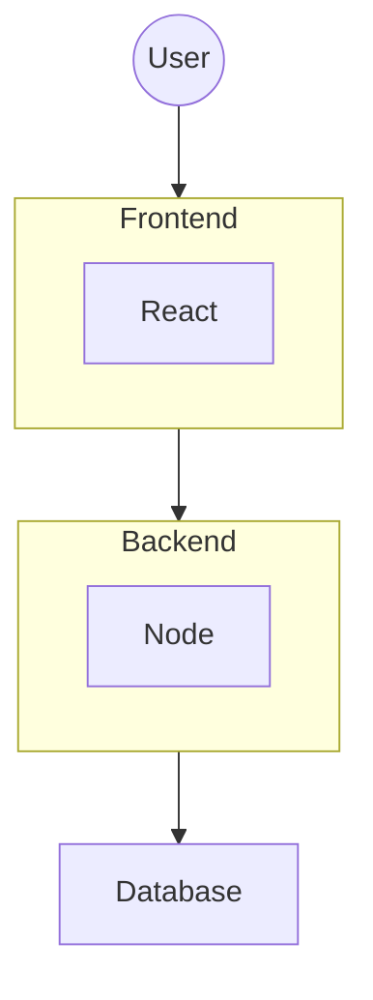

# POC 03 - React Node Setup

## System Architecture

```mermaid
  flowchart
    User(("User"))
    
    subgraph Frontend["Frontend"]
      React["React"]
    end
    
    subgraph Backend["Backend"]
      Node["Node"]
    end

    Database["Database"]

    User --> Frontend
    Frontend --> Backend
    Backend --> Database
```
