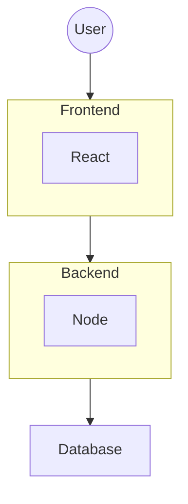

# POC 03 - React Node Setup

## System Architecture

## Servers & DNS
- Backend
  - Local: [http://localhost:5003](http://localhost:5003)
  - Build: [http://localhost:5003](http://localhost:5003)
  - Production: 

- Frontend
  - Local: [http://localhost:5173/](http://localhost:5173/)
  - Build: [http://localhost:4173/](http://localhost:4173/)
  - Production: 
