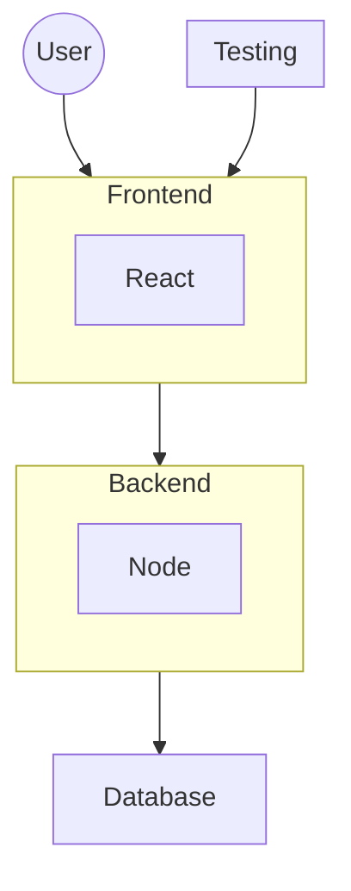

# POC 03 - React Node Setup

## System Architecture

## Servers & DNS
- Backend
  - Development
    - Local: [http://localhost:6001](http://localhost:6001)
    - Live: [https://react-node-backend-dev-v01.onrender.com](https://react-node-backend-dev-v01.onrender.com)
  - Testing
    - Local: [http://localhost:6002](http://localhost:6002)
    - Live: [https://react-node-backend-test-v01.onrender.com](https://react-node-backend-test-v01.onrender.com)
  - Staging
    - Local: [http://localhost:6003](http://localhost:6003)
    - Live: [https://react-node-backend-stage-v01.onrender.com](https://react-node-backend-stage-v01.onrender.com)
  - Production
    - Local: [http://localhost:6004](http://localhost:6004)
    - Live: [https://react-node-backend-v01.onrender.com](https://react-node-backend-v01.onrender.com)

- Frontend
  - Local: [http://localhost:5173/](http://localhost:5173/)
  - Build: [http://localhost:4173/](http://localhost:4173/)
  - Production: [https://react-node-frontend-v01.netlify.app](https://react-node-frontend-v01.netlify.app)

- Testing Report
  - Development
    - Local: [http://localhost:9323](http://localhost:9323)
    - Live: 
  - Testing
    - Local: 
    - Live: 
  - Staging
    - Local: 
    - Live: 
  - Production
    - Local: 
    - Live: 
